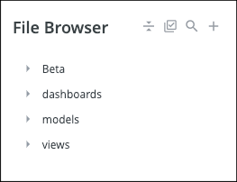

# Brooklyn Data Co. Looker style guide
- [General guidelines](#General-guidelines)
- [LookML file management](#LookML-file-management)
  - [File browser](#File-browser)
  - [File naming](#File-naming)
  - [File structure](#File-structure)
    - [Views](#Views)
      - [File layout](#File-layout)
      - [General guidelines for field naming](#General-guidelines-for-field-naming)
      - [Define value formats](#Define-value-formats)
      - [Order query results with intent](#Order-query-results-with-intent)
      - [Ordering dimension and measure parameters](#Ordering-dimension-and-measure-parameters)
    - [Models](#Models)
      - [Model LookML layout](#Model-LookML-layout)
    - [Explores](#Explores)
      - [Explore Field Picker layout](#Explore-Field-Picker-layout)
    - [Dashboards](#Dashboards)
      - [LookML dashboard and user-defined dashboards](#LookML-dashboard-and-user-defined-dashboards)
      - [LookML dashboard layout](#LookML-dashboard-layout)
      - [Dashboard LookML grooming](#Dashboard-LookML-grooming)
      - [General visualization formatting](#General-visualization-formatting)
      - [Using table calculations](#Using-table-calculations)
- [Admin](#Admin)
  - [Timezone settings](#Timezone-settings)
  - [Manage access to content in folders](#Manage-access-to-content-in-folders)
  - [Trash unused content](#Trash-unused-content)
- [Version control](#Version-control)
  - [Branch management](#Branch-management)
    - [Branch naming](#Branch-naming)
    - [Creating and deleting branches](#Creating-and-deleting-branches)
  - [Best practices and tips](#Best-practices-and-tips)
    - [PR template](#PR-template)
- [Credits and references](#Credits-and-references)
- [Other](#Other)
- [Ideas for later iterations](#Ideas-for-later-iterations)

</br>

# General guidelines
#### LookML coding principles.
Your LookML code should:
1. Be reusable and maintainable
2. Provide end users with superior UI/UX
3. Facilitate onboarding of new developers
4. Aim for clarity and brevity
5. Optimize query performance

_Inspried by LookML development experience, Looker training on SkillJar, Looker Docs, and various other LookML development articles and blog posts._

</br>

#### Identifiers such as file names, dimensions, measures, elements should use lowercase `snake_case`.
It's more readable, easier to keep consistent, and avoids having to quote identifiers due to capitalization, spaces, or other special characters. Also, keep in mind that [LookML is case sensitive](https://docs.looker.com/data-modeling/learning-lookml/what-is-lookml#lookml_is_case-sensitive).

</br>

#### Labels for fields, views, explores and models should be in `Title Case`.
For example 'Gross Revenue', instead of 'Gross revenue'. This is to match the default settings in Looker, which will add field labels based on the specified field name using title case.

Expected exceptions include cases where a field, explore, or model contains an abbreviation (e.g. ‘KPI’).

</br>

#### Avoid non-standard abbreviations in labels, titles, and other descriptive text.
Abbreviations can and should be used when the definitions are well-known and agreed upon across the organization. Optimize the stakeholder experience for accuracy, clarity, and brevity.

When abbreviations are used in labels or titles, add the full detail to the field description. This can provide context on the intended field usage for stakeholders who may not interact with the data as frequently (e.g. new to Looker or to the organization).

</br>

#### Use a new line to separate list items.
For readability, an overarching pattern is:
- If there's only one item, put it on the same line as the parameter.
- If there are multiple items, put each one on its own line (including the first one). Then, indent one level more than the parameter.

```
# Bad
explore: cohorts {
  label: "Cohort Data Tool"
  fields: [users.id, users.name, users.first_name, users.last_name, users.email, users.age, users.created_date, users.gender, users.traffic_source, users.count]

# Good
explore: cohorts {
  label: "Cohort Data Tool"
  fields: [
    users.id
    , users.name
    , users.first_name
    , users.last_name
    , users.email
    , users.age
    , users.created_date
    , users.gender
    , users.traffic_source
    , users.count
  ]
```

</br>

#### Use leading commas.
If code containing commas needs to be split across multiple lines, put the commas at the beginning of the subsequent lines, followed by a space.
- This makes it easier to spot missing commas.
- Version control diffs will be cleaner when adding to the end of a list because you don't have to add a trailing comma to the preceding line.
- The comma is only there for / because of what follows it. If nothing followed the comma it wouldn't be needed, so putting the comma on the same line as what follows it makes it clearer why it's there.

```
# Bad
explore: orders {
  always_filter: {
    filters: [dim_products.is_in_stock: "yes", fact_customers.is_sale_customer: "yes", fact_orders.is_delivered: "yes"]
  }

# Good
explore: orders {
  always_filter: {
    filters: [
      dim_products.is_in_stock: "yes"
      , fact_customers.is_sale_customer: "yes"
      , fact_orders.is_delivered: "yes"
    ]
  }
```

One **exception**: trailing commas auto-generated by Looker. For example, when using the `Create View From Table` feature, fields like timestamps (e.g., `order_completed_at`) result in dimension groups that include a list of timeframes, each one on its own line separated by a trailing comma. The effort required to update these auto-generated lines of code is greater than the value created.

</br>

#### Use `#` comment syntax.
Use a single `#` followed by a single space to begin a comment. When commenting on a field in a view file include it before the field.

Note that this is a departure from [Brooklyn Data Co.\'s preferred comment syntax for SQL](https://github.com/brooklyn-data/co/blob/main/sql_style_guide.md#always-use---comment-syntax) (`/* */`) because LookML does not recognize this syntax as a comment.

```
# Bad
  dimension: month_formatted {
    type: date
    sql: ${TABLE}."MONTH" ;;
  }
  # Date formatted dimension is required to join on other tables


# Good
  # Date formatted dimension is required to join on other tables
  dimension: month_formatted {
    type: date
    sql: ${TABLE}."MONTH" ;;
  }
```

</br>

#### Using table calculations.
If you find yourself requiring the same table calculation in more than one Look or Dashboard tile, move the logic upstream to a view file. This will make future maintenance easier and enable developers and/or users to more easily leverage the calculation in other reports.

</br>

# LookML file management
## File browser
Use folders to keep LookML files organized. Most projects will need a folder for `dashboards`, `models`, and `views`. You may find additional folders useful depending on the specific project (e.g., a `beta` folder for productionalized work that is released to a test group of users).



</br>

## File naming
Optimize for clarity and brevity. Where applicable, keep naming consistent with the underlying data model (e.g., [dbt](https://docs.getdbt.com/) data model).

</br>

## File structure
### Views
#### File layout
##### Indenting
- Do not indent structural parameters such as `include:`, `test:`, and `view:`
- Use two-space indent for each level of nested parameters below these structural parameters

</br>

##### Spacing
- Leave an empty line of code before each major section header (see [Section headers](#section-headers) below)
- Do not leave empty lines of code in between fields within the same section header

```
# Bad
  ## Primary key
  dimension: id {
    primary_key: yes
    type: number
    sql: ${TABLE}."ID" ;;
  }
  ## Foreign keys and IDs
  dimension: order_id {
    type: number
    sql: ${TABLE}."ORDER_ID" ;;
  }

  dimension: product_id {
    type: number
    sql: ${TABLE}."PRODUCT_ID" ;;
  }


# Good
  ## Primary key
  dimension: id {
    primary_key: yes
    type: number
    sql: ${TABLE}."ID" ;;
  }

  ## Foreign keys and IDs
  dimension: order_id {
    type: number
    sql: ${TABLE}."ORDER_ID" ;;
  }
  dimension: product_id {
    type: number
    sql: ${TABLE}."PRODUCT_ID" ;;
  }
```

</br>

##### Group and organize parameters
- Start View files with the LookML parameters that define the file such as:
  - `include:`
  - `view:`
  - `sql_table_name:`
  - `extends:`
  - `drill_fields:` ([for Views](https://docs.looker.com/reference/view-params/drill_fields-for-view))
- Within each [section header](#section-headers) list dimensions and dimension groups before measures

</br>

##### Section headers
- Use in-line comments as section headers to keep fields organized. The approach recommended here is designed to:
  - help developers navigate lengthy view files
  - faciliate a better user experience in the Explore by aligning / organizing fields according to the view labels under which they will be nested. Because this style guide also recommends explicitly calling fields in Explores and in joined views, this approach is especially helpful if you are building Explores that use multiple joins: having fields classified under section headers helps developers choose the fields to surface in the Explore.
- The following list includes common section headers and the preferred order to include them (when applicable).
  - `## Primary Key` - Whenever possible define the primary key
  - `## Parameters` - These fields will appear to the user under the ‘Filter-Only Fields’ section of the   field picker
  - `## Filters` - These fields will appear to the user under the ‘Filter-Only Fields’ section of the field   picker.
  - `## Foreign keys and IDs` - Hide keys and IDs that you expect users will not interact with (e.g.,   `product_id` or `distribution_center_id`)
  - `## Timestamps`
  - `## Duration`
  - `## Flags` - Yes/No fields. These are typically modeled as `is_[characteristic]` or `has_[characteristic]`
  - `## Properties` - List descriptive characteristics here such as `size`, `color`, `operating_system`, and `event_type`
  - `## Statuses`
  - `## Revenue`
  - `## Costs`
  - `## SLAs` - These fields contain Service Level Agreements
  - `## Ratios and Percents`
  - `## Sets`

_The list above is meant to serve as a guide only. You should adapt the number of sections in your list to the complexity of the modeling work and according to your use case._

###### Section header layout and special cases
- Use a single indentation to align section headers with the beginning of field declarations
- Begin headers with two hashes (##) and a space
- Group hidden fields in each section into a sub-section named `### Hidden`. This streamlines interacting with and reviewing what can be added to Explores the view file.
- Within each section header do list:
  - visible (i.e. not hidden) fields first
  - dimensions and dimension groups before measures
  - alphabetically to make it easier to find fields when scrolling through view files

</br>

##### Sample View file
- Your View file should look something like this [sample view file](looker_style_guide_code_snippets/sample_view_file.md)
  - Productivity tip: You can fold LookML to see a condensed view of the file. See [Shortcuts in the LookML development environment](https://docs.looker.com/exploring-data/exploring-data/keyboard-shortcuts#shortcuts_in_the_lookml_development_environment) for details.

</br>

#### General guidelines for field naming
##### Dimensions
###### Flags
- When naming `yesno` fields (e.g., `## Flags`), use an interrogative structure (e.g., “Is Returned” instead of “Returned”). This more naturally lends itself to the ‘yes’ or ‘no’ that appears in the column.
- Do not include “Yes/No” in the label of a `yesno` (boolean) field. Looker includes this by default.

```
# Bad
  dimension: returned {
    type: yesno
    sql: ${returned_raw} IS NOT NULL ;;
    label: "Is Returned Item (Yes/No)"
  }

# Good
  dimension: is_returned {
    type: yesno
    sql: ${returned_raw} IS NOT NULL ;;
    label: "Is Returned Item"
  }
```

</br>

###### Dimension group timeframes
- Avoid the words `at`, `date` or `time` at the end of a dimension group field name. Looker appends each timeframe to the end of the dimension name: `created_date` becomes `created_date_date`, `created_date_month`, etc.
  - Instead use `created` which becomes `created_date`, `created_month`, etc.

```
# Bad
  dimension_group: created_at {
    type: time
    timeframes: [
      time,
      date,
      week,
      month,
      raw
    ]
    sql: ${TABLE}.created_at ;;
  }

# Good
  dimension_group: created {
    type: time
    timeframes: [
      time,
      date,
      week,
      month,
      raw
    ]
    sql: ${TABLE}.created_at ;;
  }
```

</br>

##### Measures
- Whenever possible measures should reference LookML dimensions rather than the source table.

```
# Bad
  measure: total_transaction_amount {
    type: sum
    sql: ${TABLE}."TRANSACTION.AMOUNT"
    value_format_name: usd
  }

# Good
  measure: total_transaction_amount {
    type: sum
    sql: ${transaction_amount}
    value_format_name: usd
  }
```

</br>

- If a measure and a dimension reference the same ${TABLE}.”field\_name”, prefix the dimension with an underscore to differentiate between the two.

```
# Bad
  dimension: order_subtotal_usd {
    type: sum
    sql: ${TABLE}."ORDER_SUBTOTAL_USD" ;;
  }
  measure: order_subtotal_usd_measure {
    label: "Order Subtotal USD"
    type: sum
    sql: ${TABLE}."ORDER_SUBTOTAL_USD" ;;
  }

# Good
  dimension: _order_subtotal_usd {
      label: "Order Subtotal USD"
      type: sum
      sql: ${TABLE}."ORDER_SUBTOTAL_USD" ;;
    }
  measure: order_subtotal_usd {
      type: sum
      sql: ${_order_subtotal_usd} ;;
    }
```

</br>

###### Aggregate functions
- Use a common term to name [aggregate measures](https://docs.looker.com/reference/field-reference/measure-type-reference#measure_type_categories). For example:
  - Sum: `total_[FIELD_NAME]`
  - Count: `count_[FIELD_NAME]`
  - Average: `avg_[FIELD_NAME]`
  - Max: `max_[FIELD_NAME]`
  - Min: `min_[FIELD_NAME]`
  - Median: `median_[FIELD_NAME]`

```
# Bad
  measure: sale_price {
    type: sum
    .
    .
    .
  }

# Good
  measure: total_sale_price {
    type: sum
    .
    .
    .
  }
```

</br>

###### Ratios
- Give ratios concise but descriptive field names

```
# Bad
  measure: customer_repeat_rate {
    description: "The percentage of customers who purchase again within 30 days"
    .
    .
    .
  }

# Good
  measure: 30_day_repeat_purchase_rate {
    description: "The percentage of customers who purchase again within 30 days"
    .
    .
    .
  }
```

</br>

##### Descriptions
- Use accurate, concise descriptions in all fields to help non-technical users navigate Looker with little or no help

```
# Bad
  dimension: first_to_last_order_days {
    description: "Number of days as customer"
    .
    .
    .
  }
  measure: brand_share_of_wallet_within_company {
    description: "This particular brand's sales in dollars (all transactions in foreign currencies are translated to USD) divided by the total sales across our entire website, including full-price and sale items"
    .
    .
    .
  }

# Good
  dimension: first_to_last_order_days {
      description: "Days between first and latest order"
      .
      .
      .
    }
  measure: brand_share_of_wallet_within_company {
    description: "This brand's sales divided by all sales"
    .
    .
    .
  }
```

</br>

#### Define value formats
##### Currencies
- By default cast currency values with no cents (e.g., `value_format_name: usd_0`)
- Display cents (e.g., `value_format_name: usd`) if they provide analytical value or are required

</br>

##### Numbers
- By default cast numeric values with no decimals (e.g., `value_format_name: decimal_0`)
- Display decimals (e.g., `value_format_name: decimal_1`, `value_format_name: decimal_2`) if they provide analytical value or are required. The preference is to display the fewest number of decimals as needed to meet the business stakeholders' requirements.

</br>

##### Percents
- By default cast percents with no decimals (e.g., `value_format_name: percent_0`)
- Display decimals (e.g., `value_format_name: percent_1`, `value_format_name: percent_2`) if they provide analytical value or are required. The preference is to display the fewest number of decimals as needed to meet the business stakeholders' requirements.

Check out Looker’s documentation on [value_format](https://docs.looker.com/reference/field-params/value_format) if you need to customize formatting.

</br>

#### Order query results with intent
You can sort results of a dimension, dimension group, or measure using the [order_by_field](https://docs.looker.com/reference/field-params/order_by_field) parameter in LookML. This can be particularly useful in some situations. For example, you can overwrite Looker’s default behavior to order `delivery_status` alphabetically and order results in based on business logic, instead.

| Sort alphabetically  | Sort according to business logic |
| :-------------: | :-------------: |
| (default behavior)    | (applying order_by_field) |
| Cancelled  | Pending  |
| Delivered  | Ordered  |
| Ordered  | Shipped  |
| Pending  | Delivered  |
| Shipped  | Cancelled  |

</br>

#### Ordering dimension and measure parameters
There are [dozens of parameters](https://docs.looker.com/reference/field-reference) you can add to your dimension and measure definitions. We’ve highlighted commonly used parameters and recommend listing them in the following order (note: not all fields are required and in many cases shouldn’t be used together):

```
# Dimensions
  dimension: {
    primary_key:
    hidden:
    view_label:
    label:
    group_label:
    group_item_label:
    description:
    type:
    sql: ;;
    value_format_name:
    drill_fields: []
  }

# Measures
  measure: {
    hidden:
    view_label:
    label:
    group_label:
    group_item_label:
    description:
    type:
    sql:  ;;
    value_format_name:
    drill_fields: []
  }
```

</br>

#### Avoid derived tables
Brooklyn Data Co.\'s preference is to build Looker projects on top of a robust data warehouse using [dbt](https://docs.getdbt.com/) for data transformations. While there are occasional exceptions to the rule, move [derived tables](https://docs.looker.com/data-modeling/learning-lookml/derived-tables) to the underlying data model and adding dimensions and measures as needed to your LookML views whenever possible.
- If you need to use a derived table, model them in a separate view file.
Remember that you can keep your LookML code DRY (Don't Repeat Yourself) by referencing a derived table in another view using `.SQL_TABLE_NAME`. See the [documentation](https://docs.looker.com/reference/view-params/sql-for-derived_table) for more details.

</br>

#### Using Liquid reference
- Use new lines to separate Liquid tags and SQL/Looker fields
- Use two spaces to indent each condition from the LookML parameter and four spaces to indent each output item.

</br>

```
# Bad
  dimension: customer_lifetime_orders {
    type: number
    sql: ${TABLE}."CUSTOMER_LIFETIME_ORDERS" ;;
    html:
       <font color="darkgreen">{{ rendered_value }}</font>
       <font color="darkred">{{ rendered_value }}</font>
       ;;
  }

# Good
  dimension: customer_lifetime_orders {
    type: number
    sql: ${TABLE}."CUSTOMER_LIFETIME_ORDERS" ;;
    html:
      
        <font color="darkgreen">{{ rendered_value }}</font>
      
        <font color="darkred">{{ rendered_value }}</font>
       ;;
  }
```

</br>

### Models
#### Model LookML layout
##### Overall
- Use in-line comments as section headers. Common section headers and their order include:
  - \## Model configuration
  - \## Explores
- Use the order of the following parameters (where applicable) to define your LookML Model
  - Include an empty line of code after each one of these parameters

</br>

```
label:

connection:

datagroup:

access_grant:

include:

explore:

  join:

  join:
```

</br>

##### Label
- Use [label (for models)](https://docs.looker.com/reference/model-params/label-for-model) to define a custom label if the model’s name isn’t concise or descriptive enough for the Explore menu

</br>

##### Include
- Include all views from the `views` folder in the project (`"/views/*.view.lkml"`) unless there is a reason not to
- Similarly, include all dashboards from the `dashboards folder` in the project (`"/dashboard/*.dashboard.lkml"`) unless there is a reason not to

</br>

##### Explore
###### Overall
- Use the order of the following applicable parameters to define your [explores](https://docs.looker.com/reference/explore-reference)

```
  explore:
    hidden:
    label:
    group_label:
    description:
    extension:
    extends:
    required_access_grants:
    access_filter:
    always_filter:
    sql_always_where:
    view_name:
    query:
    fields:
    always_join:
    join: {
      from:
      required_access_grants:
      view_label:
      fields:
      relationship:
      type:
      sql_on:
      sql_where:
  }
 ```

</br>

###### Creating new explores
- Avoid developing a single ‘one-stop’ Explore
  - Optimize the data consumer’s (i.e. non-technical user’s) experience by creating one Explore for each set of related business questions
  - For example, business users at an e-commerce company analyzing orders might be overwhelmed by all the possible details related to a customer sale included in a single Explore. Developers should create multiple Explores to help users have a more a focused experience (e.g., Explores for Customers, Orders, Products, Shipping, etc.)

</br>

###### Explicitly select fields in Explores
- Use the [fields (for Explores)](https://docs.looker.com/reference/explore-params/fields-for-explore) parameter to explicitly select all the fields or sets to be included in the Explore.
  - LookML developers will easily be able to identify which fields are included in the Explore without having to reference the view file or loading the Explore. This is especially helpful when the Explore includes multiple joins and a subset of fields from each joined model.

</br>

##### Joining guidelines
- Include only the joins you need to satisfy reporting requirements. Additional joins can negatively impact query performance and introduces additional code maintenance complexity
- When possible be explicit with LookML in your joins. This will make your intentions clearer for other developers -- especially less experienced developers on your team -- when reading, maintaining, or updating the Explore. Specific examples include:
  - Do join views using `sql_on` instead of `foreign_key`
  - Do use `relationship: many_to_one` and `type: left_outer` (where applicable) even though these are Looker’s default relationship and join type
  - Do use fully scoped fields with the [fields (for Explores) parameter](https://docs.looker.com/reference/explore-params/fields-for-explore) to explicitly identify what users will see in the Explore's field picker
- Although LookML uses [symmetric aggregates](https://docs.looker.com/reference/explore-params/symmetric_aggregates) by default to protect against fanout, use ‘many-to-one’ whenever possible. Some reasons for this extra caution include:
  - Not all SQL dialects support symmetric aggregates (see the [list of dialects](https://docs.looker.com/reference/explore-params/symmetric_aggregates#definition) that support symmetric aggregates)
  - It is possible to disable symmetric aggregates, in which case you'll need properly defined joins to avoid fanout
  - Protect developers (including yourself!) who may use the Looker generated SQL to debug or run an ad-hoc report (e.g., in SQL Runner, in an IDE)
  - Read more about this topic in this [Looker blog post](https://looker.com/blog/aggregate-functions-gone-bad-and-the-joins-who-made-them-that-way) and [Looker Community post](https://community.looker.com/lookml-5/symmetric-aggregates-261)
- For more detail check out Looker's documentaiton on [Working with joins in LookML](https://docs.looker.com/data-modeling/learning-lookml/working-with-joins)

</br>

##### Sample model file
- Your model file should look something like this [sample model file](looker_style_guide_code_snippets/sample_model_file.md):
  - Not all parameters are required and in some cases shouldn’t be used together

</br>

### Explores
#### Explore Field Picker layout
##### View label guidelines
- Use view labels to help data consumers quickly navigate the Explore Field Picker
  - It’s preferable to define with view labels at the [field level](https://docs.looker.com/reference/field-params/view_label) to ensure a consistent UX across various Explores
  - For fields that roll up to different view labels -- depending on the Explore -- consider using view label [for Views](https://docs.looker.com/reference/view-params/label), [for Joins](https://docs.looker.com/reference/explore-params/view_label-for-join), [for Explores](https://docs.looker.com/reference/explore-params/view_label-for-explore)
  - Standard view labels for common Explores may include:

| **Explore**  | **Orders, Order Items, Products**, and similar…   | **Web Event Data, Web Session Data**, and similar…  |
|:--------------:|:-------------:|:-----------------------:|
| View labels  |  *_IDs      |  *_IDs                |
|              |  Customers  |  Funnel Metrics       |
|              |  Orders     |  Products             |
|              |  Products   |  Session Bounce Page  |
|              |  Shipping   |  Session Landing Page |
|              |  Timestamps |  Sessions             |
|              |  Users      |  Users                |
|              |             |  Visitors             |
|              |             |  Timestamps           |

</br>

### Dashboards
#### LookML dashboard and user-defined dashboards
[LookML dashboards](https://docs.looker.com/reference/lookml-dashboard-overview) are stored as version-controlled files associated with the project in a Git repository. They also provide LookML developers with a way to update or modify a dashboard in bulk.

[User-defined dashboards](https://docs.looker.com/dashboards/creating-dashboards-beta) (UDDs) are great for putting together mock-ups / proof of concepts / MVPs of dashboards. They’re also a great way to give non-technical and non-developers a way to build and collect relevant visualizations together in one place.
- Typically you should start dashboard development with UDDs (which can easily be converted to [LookML dashboards](https://docs.looker.com/dashboards/new-dashboard-experience#getting_the_lookml_from_a_dashboard)).
  - Only convert to a LookML dashboard when necessary  (e.g., when you need to bulk edit tiles) as this adds additional code to the model which needs to be maintained and peer reviewed when introducing changes.

</br>

#### LookML dashboard layout
##### Overall
LookML Dashboard files can easily become long and challenging to read through. Use the following to facilitate your development work, peer review, and future code maintenance.

- Create a separate `.dashboard` file for each LookML dashboard
- Use in line comments to create sections of code within the file
  - Begin headers with two hashes (`##`) and a space
- Do not indent major headers and include a blank line before each major header
  - Examples include `## Configuration`, `## Filters`, `## Elements`

```
## Configuration
- dashboard: overall_sales
  title: Overall sales
  layout: grid
  .
  .
  .

## Filters
filters:
  - name: date
    title: 'Date Range'
    type: date_filter
    .
    .
    .

## Embedded dashboard
embed_style:
    background_color:
    show_title:
    .
    .
    .

## Elements
```

</br>

##### Elements
- Use major section headers as guide posts to divide your elements up into meaningful blocks. These might correspond to the rendered layout of the dashboard or use some other logic.
  - Example 1

    ```
    ## Company-wide performance

    ## Regional performance

    ## State performance

    ## Website performance
    ```

  - Example 2

    ```
    ## Single value visualizations

    ## Graphical visualizations

    ## Tabular visualizations
    ```

  - Example 3

    ```
    ## Row 1

    ## Row 2

    ## Row 3

    ## Row 4
    ```

</br>

  - Ultimately, the goal here is to keep you more organized in the development process and to help your peers when they’re reviewing unfamiliar Dashboard LookML code

```
## Section 1
  ## Basic parameters
  - name: [element_1]
    .
    .
    .

  ## Basic parameters
  - name: [element_2]
    .
    .
    .

## Section 2
```

</br>

##### Within elements
- Use in line comments to break up each group of element-defining parameters
  - Indent one level more than the section headers.
  - Examples include `## Basic parameters`, `## Layout`, `## Tool tip`, `## Measure and dimensions`, `## Filters`, and `## Axes, legends, series attributes, and sorts`

```
## Section 1
  ## Basic parameters

  ## Layout

  ## Tool tip

  ## Measures and dimensions

  ## Filters

  ## Axes, legend, series attributes, and sorts

## Section 2
  ## Basic parameters
  .
  .
  .
```

</br>

###### \## Basic parameters
- Start off with basic parameters like `name:`, `title:`, and `type:`.

</br>

###### \## Layout
- Define the position of the dashboard element (where applicable)

</br>

###### \## Tool tip
- Include tool tips (where applicable) here (e.g. a [note on a pie chart](https://docs.looker.com/reference/dashboard-reference/lookml-visualization-reference/pie-params#note))

</br>

###### \## Measures and dimensions
- List the parameters that define the measures and dimensions
- Leave a blank row only between table calculations

</br>

###### \## Filters
- List the parameters that will change what data is surfaced in the visualizations

</br>

###### \## Axes, legends, series attributes, and sorts
- List the parameters that will change how the the visualization looks

</br>

##### Sample LookML Dashboard file
The layout of your Dashboard LookML file should look something like this [sample LookML Dashboard file](looker_style_guide_code_snippets/sample_dashboard_file.md):

</br>

#### Dashboard LookML grooming
- Include only the parameters that impact how the dashboard’s visualizations look
  - For example, when using `Get LookML` from an Explore query, Looker will (by default) include some parameters that are set to their defaults or are null even though they don’t change how visualizations are rendered.
  - Keeping these parameters makes dashboard LookML files unnecessarily longer and can make code maintenance more time consuming.

```
# Bad (37 lines of code)
- name: add_a_unique_name_1613506330
  title: Untitled Visualization
  model: thelook
  explore: order_items
  type: looker_column
  fields: [distribution_centers.name, order_items.order_count]
  sorts: [order_items.order_count desc]
  limit: 500
  x_axis_gridlines: false
  y_axis_gridlines: true
  show_view_names: false
  show_y_axis_labels: true
  show_y_axis_ticks: true
  y_axis_tick_density: default
  y_axis_tick_density_custom: 5
  show_x_axis_label: true
  show_x_axis_ticks: true
  y_axis_scale_mode: linear
  x_axis_reversed: false
  y_axis_reversed: false
  plot_size_by_field: false
  trellis: ''
  stacking: ''
  limit_displayed_rows: false
  legend_position: center
  point_style: none
  show_value_labels: false
  label_density: 25
  x_axis_scale: auto
  y_axis_combined: true
  ordering: none
  show_null_labels: false
  show_totals_labels: false
  show_silhouette: false
  totals_color: "#808080"
  series_types: {}
  defaults_version: 1

# Good (10 lines of code)
- name: distribution_center_orders
  title: Order count by distribution center
  model: thelook
  explore: order_items
  type: looker_column
  fields: [
    distribution_centers.name
    , order_items.order_count
  ]
  sorts: [order_items.order_count desc]
```

</br>

#### General visualization formatting
The following guidelines apply to LookML and user-defined dashboards.

</br>

##### Y-axis labels
- Truncate the displayed values to contextually meaningful values.

```
# Scenario
Executive dashboard summarizing quarterly sales performance where
reported values are in the magnitude of thousands and millions of dollars.

# Bad
Report whole dollar amounts such as $55,237.06 and $45,811,972.24.

# Good
Report truncated dollar amounts such as $55.0K and $45.8M.
```

- Don’t include a y-axis title for charts with a single y-axis and the measure is included in the chart title.

```
# Scenario
A chart titled "Customer orders per day"

# Bad
Label the y-axis as "Order count"

# Good
Leave the y-axis unlabeled
```

</br>

##### X-axis labels
- Don’t include an x-axis title for charts that include the dimension in the chart title

```
# Scenario
A chart titled "Daily web event sessions" or "Orders by status"

# Bad
Label the x-axis as "Date" or "Status", respectively

# Good
Leave the x-axis unlabeled
```

</br>

##### Date axis
- Use uniform date formatting throughout the dashboard. See [looker documentation](https://docs.looker.com/exploring-data/visualizing-query-results/time-formatting-for-charts) for description and date expressions

```
# Scenario
Two looks in same dashboard:
  1. Monthly order count
  2. Monthly revenue

# Bad
  1. Monthly order count with x-axis labeled ‘March-2020’
  2. Monthly revenue with x-axis labeled ‘2020-03’

# Good
  1. Monthly order count with x-axis labeled ‘2020-03’
  2. Monthly revenue with x-axis labeled ‘2020-03’

  OR

  1. Monthly order count with x-axis labeled ‘March-2020’
  2. Monthly revenue with x-axis labeled ‘March-2020’.
```

</br>

##### Filtering
- Keep your code DRY (Don't Repeat Yourself) and use an overall filter for all fields that have the same definition and the same taxonomy
  - For example: if the customer and vendor location are entered using the same taxonomy (e.g US-NY), then you can use one overall dashboard filter for both location fields

</br>

##### Inclusive visualization designs
Develop visualizations that are inclusive to a wide audience of users. Avoid obscure abbreviations and terminology, be mindful about the size of text and images, and consider users with visual deficiencies.

Tools like Google Chrome’s DevTools allow you to [emulate vision deficiencies](https://developers.google.com/web/updates/2020/03/devtools) in the development process before pushing work to production. Also, [Looker’s Color Collection Pallets](https://docs.looker.com/exploring-data/visualizing-query-results/color-collections#lookers_color_collection_palettes) includes the Dalton color collection which accommodates various forms of color vision deficiency.

Where appropriate, conditionally format with [html or within the UI](https://help.looker.com/hc/en-us/articles/360001288648-How-to-Change-Colors-and-Fonts-Using-HTML#:~:text=There%20is%20also%20an%20option,visualization%20in%20the%20Rule%20section.). You can define font color or even include a visual cue (e.g., [unicode characters](https://unicode-table.com/en/)) to help communicate an attribute of the data. For example, a table that includes the YoY % change in sales might be displayed in green font and with an “▲” to indicate positive change or red font with a “▼“ to indicate negative change.

</br>

-----
# Admin
## Timezone settings
- Configure the [Database Time Zone](https://docs.looker.com/admin-options/tutorials/timezones#database_time_zone) and [Query Time Zone](https://docs.looker.com/admin-options/tutorials/timezones#query_time_zone) (where applicable) settings to the reporting timezone. Otherwise some users might assume `current_timestamp`, timestamp columns, etc. are in UTC and can apply incorrect offsets.

</br>

## Manage access to content in folders
- You can decide who has access to view or edit dashboards and Looks in your folder by using the [Manage Access feature](https://docs.looker.com/sharing-and-publishing/organizing-spaces). This is helpful when you want to limit access to your reports to specific users. For example, you might be building a dashboard that’s still a WIP (Work In Progress) and you’re not ready for others to use the unvalidated reports, yet.

</br>

## Trash unused content
- When searching for a Look or dashboard, it can be frustrating having to go through multiple results to find what you're looking for. Consider [trashing unused content](https://docs.looker.com/sharing-and-publishing/admin-spaces) (e.g, content not viewed in the last 90 days). If there's demand for it, ask the requestor questions to be sure it's really important and verify whether there's an alternative report available before taking it out of trash.

</br>

-----
# Version control
## Branch management
### Branch naming
Prefix branch names with the purpose of the development work followed by a brief description of the work. Separate these details with a `/` and use `-` between words.

Common prefixes include `feature/`, `fix/`, and `update/`.

```
# Bad
incl_new_report_for_stakeholders
important_updates_requested_by_stakeholders
sprint-4-development-work-include-a-new-feature-for-the-sales-team

# Good
feature/sales-dashboard
fix/marketing-dashboard-table-calcs
update/dashboard-color-palettes
```

</br>

### Creating and deleting branches
Create a new branch in Looker for each task. Typically, each developer task is related to a single issue or user story which helps signal when a new branch is needed and when that branch can be deleted (e.g., when the issue is closed, the feature has been deployed).

If you’re using a version control integration (e.g., GitHub) remember to delete the branch there and [in your Looker instance](https://docs.looker.com/data-modeling/getting-started/version-control-and-deploying-changes#deleting_git_branches).

</br>

## Best practices and tips
- Before you begin development work, ensure the branch you are using is up to date with master branch
- Commit changes in logical chucks
  - Avoid committing multiple unrelated tasks in the same commit
  - Resolve all LookML warnings and errors before committing.
    - Toggle the Admin feature [Code Quality](https://docs.looker.com/data-modeling/getting-started/git-options). Specifically, “Require fixing errors and warnings before committing,” to enforce code quality before committing.
- QA between production and development mode
  - Are there any key Looks or dashboards affected? (Consider using the [Content Validator](https://docs.looker.com/data-modeling/getting-started/look-validation))
  - Are the figures affected negatively by joins and other code changes?
- Document your reasoning
  - Consider using a PR template (see below)

</br>

### PR template
PR reviews should be a part of the Looker development workflow. Use a [PR template](https://docs.github.com/en/free-pro-team@latest/github/building-a-strong-community/creating-a-pull-request-template-for-your-repository) to standardize what gets documented in the PR. The template also serves as a reminder to developers about what they need do before merging changes into production (see `## Checklist` below).

Here’s a Brooklyn Data Co.'s Looker PR template:

```
## Overview
_Summarize the goal of your work and what motivated it._

## Key changes
- _Describe major updates._

## Other notes
- _List open questions and other things your reviewer should know._

## Related links
- _List links to related ticket(s)._
- _(optional) Link to other files and resources, such as specific related reports in Looker._

## QA
- _List links to related QA or describe QA work and findings._

## Checklist
- [ ] New code follows [Looker style guide](insert link when published).
- [ ] Communicating with users:
    - [ ] This PR will not impact / break existing stakeholder workflow(s).
    - [ ] This PR will impact / break existing stakeholder workflow(s) and there is a plan in place to communicate them.
- [ ] Model(s) connection(s) were reverted to production

## Screenshots
_(optional) Include screenshots that demonstrate the new feature(s)._
```

</br>

-----
# Resources referenced while writing the style guide
- <https://github.com/brooklyn-data/co/blob/master/sql_style_guide.md>
- <https://github.com/brooklyn-data/co/blob/master/dbt_coding_conventions.md>
- <https://das42.com/insights/the-ultimate-lookml-style-guide/>
- <https://docs.looker.com/?version=7.14>
- <https://discourse.looker.com/t/lookml-best-practices/1636>
- SkillJar - Looker Training - SQL Tutorial for Business Analytics
- Internal Brooklyn Data Co. wiki pages
- <https://looker-open-source.github.io/look-at-me-sideways/rules.html>
- <https://help.looker.com/hc/en-us/articles/360001784747-Best-Practice-LookML-Dos-and-Don-ts>
- <https://help.looker.com/hc/en-us/articles/360001784587-Best-Practice-Writing-Sustainable-Maintainable-LookML>
- <https://help.looker.com/hc/en-us/articles/360001766908-Best-Practice-Create-a-Positive-Experience-for-Looker-Users>
- <https://discourse.looker.com/t/example-lookml-development-guidelines/5979>
- <https://www.agileconnection.com/article/picking-right-branch-merge-strategy>

</br>

-----
# Ideas for later iterations

We've outlined topics planned for future iterations of this style guide. Your suggestions and contributions to any published content (above) or planned topics (below) are welcome!

1. dbt vs LookML
2. DRY (Don't Repeat Yourself)
    - Group and group item labels
3. Views
    - When _not_ to use Liquid
    - Clearer guidance on using section headers
4. Models
    - Datagroups
    - Persist with
    - Access grants
5. Explores
    - Opinions about:
      - How many Explores to include per model?
      - How many view labels to include in each Explore?
      - How many fields to include in each Explore?
      - Should we use just one `fields:` parameter with fully scoped fields, or multiple `fields:` parameters (one for each view)?
6. Dashboards
     - User-defined dashboard (UDD)
       - General guidelines
       - When to use UDDs vs LookML dashboards
     - List preferred chart types for common data questions / visualizations
     - Take a stance on how to displaydates (e.g, YYYY-MM, or Month 'YY, or Mon 'YY, or Mon-YY, etc.)
     - Guidance on working with `drill_field:`
     - Include screenshots to visually comminicate guidelines / recommendations
7. Version control
    - Commit messages
    - Commit frequency
8. Access Control
    - Using permission sets and roles
9. Admin
    - Guidance on configuring the Looker project
